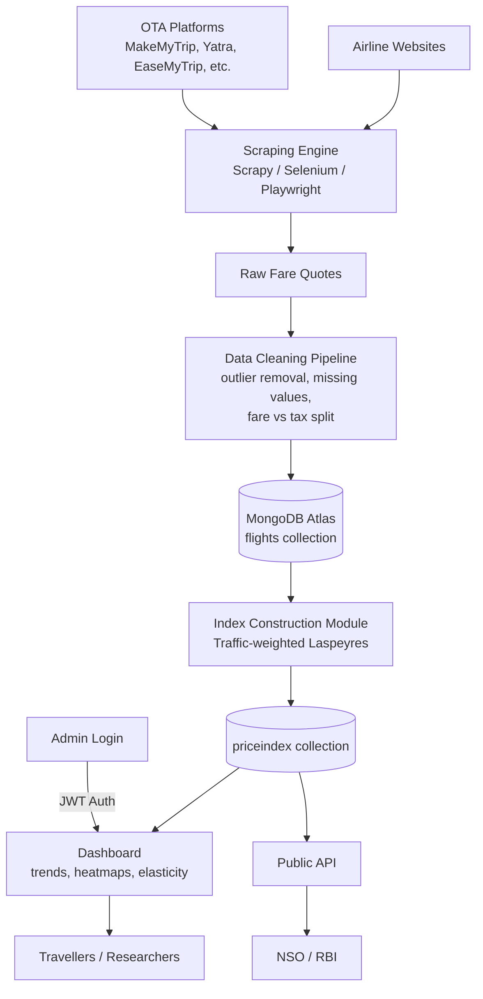

# VAYU-Index (APIx) — Real-Time Airfare Price Index for India

> A real-time, web-scraped Airfare Price Index built to augment India's Consumer Price Index (CPI), developed for **Smart India Hackathon 2026 — Problem Statement SIH26056**.

**Team:** AlgoVerse1_SIH26056 <br>
**Problem Statement ID:** SIH26056<br>
**Ministry:** Ministry of Statistics and Programme Implementation (MoSPI)<br>
**Category:** Smart Automation

---

## 📌 Problem Statement

India's official CPI (released by NSO/MoSPI) measures retail inflation and is used by the RBI for monetary policy decisions. However, the airfare component of CPI's 'Transport and Communication' sub-group is still collected **manually** from a limited set of outlets — even though **90%+ of domestic air tickets are now booked online** through airline websites and OTAs (MakeMyTrip, Yatra, EaseMyTrip, Cleartrip, Ixigo, Goibibo).

Airfares are highly dynamic — the same route can vary **200–400% within a single day** depending on booking window, demand, season, and fuel surcharges. Manual, infrequent sampling cannot capture this, meaning CPI's transport data doesn't reflect what Indian travellers actually pay.

**VAYU-Index (APIx)** addresses this by proposing an automated, scalable system to scrape, clean, and index airfare data in near real time.

---

## 🎯 Solution Overview

An end-to-end platform that:
- Collects airfare data from major Indian airlines and OTAs
- Cleans and normalises raw price quotes
- Computes a **Real-time Airfare Price Index (APIx)** at daily, weekly, and monthly frequency
- Visualises trends through an interactive dashboard
- Exposes the index via a public API for institutions like NSO and RBI

### Key Differentiators
- **Passenger-traffic-weighted Laspeyres index** — city-pair weights derived from DGCA passenger traffic data
- **Spike detection** — automatically flags abnormal fare surges (festival demand, fuel surcharges, etc.)
- **Plain-English index summary** — auto-generates a self-explaining sentence describing the day's index movement, not just a number

---

## 🧩 Scope

### In Scope
- Airfare data from 5 major airlines (IndiGo, Air India, Air India Express, Akasa Air, SpiceJet) + leading OTAs
- Key domestic city-pairs selected via DGCA traffic data (e.g. DEL-BOM, DEL-BLR, BOM-BLR, DEL-CCU, BLR-HYD, MAA-DEL)
- Multiple advance-purchase windows: T+1, T+7, T+15, T+30, T+45 days
- Daily / weekly / monthly index computation
- Cleaned database, dashboard, and public API
- Target users: NSO, RBI, researchers, travellers

### Out of Scope (current prototype)
- International flight routes
- Full production-scale live scraping (current build simulates the pipeline with mock data)
- Bypassing CAPTCHAs / anti-bot systems (avoided for legal and ethical reasons)
- Official integration into India's published CPI (this is a proposed tool, not a live government system)

---

## 🔄 System Flow / Architecture



**How it works, step by step:**
1. Scraper pulls live fares from airline sites and OTAs
2. Raw quotes are cleaned — errors, missing data, and cancelled flights are handled; base fare is separated from taxes
3. Cleaned data is stored in MongoDB (`flights` collection)
4. The index module computes a traffic-weighted Airfare Price Index from that data
5. Index values are stored (`priceindex` collection) and served two ways:
   - **Dashboard** — for humans to view trends, heatmaps, and elasticity curves
   - **Public API** — for institutions like NSO/RBI to consume programmatically
6. Admins authenticate via JWT to manage the system

> GitHub renders the diagram above automatically since it's Mermaid syntax — no image needed.

---

## 🏗️ Tech Stack

### Frontend
- **React** — UI framework
- **Vite** — build tool & dev server

### Backend
- **Express.js** (Node.js) — API layer
- **Flask** (Python) — simulates scraping/ingestion endpoint

### Database
- **MongoDB Atlas** — cloud database with collections:
  - `flights` — raw/cleaned fare records
  - `priceindex` — computed index values over time
  - `users` — admin accounts

### Authentication
- **JWT (JSON Web Tokens)** — admin authentication

### Planned / Future Integration
- **Python** scraping engine (Scrapy / Selenium / Playwright)
- Data-cleaning pipeline (outlier removal, missing-value handling, fare-component separation)

> **Note:** The current prototype simulates live scraping using a mock-data endpoint. The production-grade scraper, cleaning pipeline, and index-construction module are planned future work — see [Future Scope](#-future-scope).

---

## 🗄️ Database Schema (high level)

| Collection | Purpose | Key Fields |
|---|---|---|
| `flights` | Stores individual fare quotes | origin, destination, carrier, advance-purchase window, fare class, base fare, taxes, total fare |
| `priceindex` | Stores computed index values | date, frequency (daily/weekly/monthly), index value, route weights |
| `users` | Admin authentication | username, hashed password, role |

---

## ⚙️ Getting Started

### Prerequisites
- Node.js (v18+ recommended)
- npm
- MongoDB Atlas connection string (or local MongoDB instance)

### Installation

```bash
# Clone the repository
git clone <your-repo-url>
cd vayu-index

# Install dependencies
npm install
```

### Environment Variables

Create a `.env` file in the root directory:

```
MONGODB_URI=your_mongodb_atlas_connection_string
JWT_SECRET=your_jwt_secret_key
PORT=3000
```

### Running the Project

```bash
npm run dev
```

The app should start on `http://localhost:3000` (or the port configured in `.env`).

> **Troubleshooting:** If you see `EADDRINUSE` (port already in use), either close any other terminal already running the dev server, or free the port:
> ```bash
> netstat -ano | findstr :3000
> taskkill /PID <PID_number> /F
> ```

---

## 📊 Dashboard Features

- Price trend charts by route
- Sector-wise fare heatmaps
- Lead-time elasticity curves (how fare changes with booking window)
- Daily Airfare Price Index summary with plain-English explanation

---

## 🔮 Future Scope

- Feed APIx as an official input into MoSPI's CPI Transport sub-group
- Replace manual fare collection with fully automated, nationwide scraping
- Support RBI's inflation-targeting framework with faster, real-time fare data
- Expand from domestic to international routes
- Scale the route basket to all DGCA-tracked sectors
- ML-based fare forecasting to predict future price/inflation trends
- Formal data-sharing agreements with airlines and OTAs for verified access
- State/region-wise inflation breakdown

---

## 🌍 Impact

| Stakeholder | Benefit |
|---|---|
| **RBI** | More accurate inflation data for policy decisions |
| **NSO/MoSPI** | Modernized, automated data collection |
| **Travellers** | Transparent pricing, better booking decisions |
| **Researchers/Policymakers** | Reliable data for aviation & economic studies |
| **Airlines/OTAs** | Fair pricing benchmark, market insights |

---

## 📚 Research & References

**Foundational research (why web-scraped price indices work):**
- Cavallo, A. & Rigobon, R. (2016). *The Billion Prices Project: Using Online Prices for Measurement and Research.* NBER Working Paper No. 22111.
- UK ONS — *Research Indices Using Web Scraped Price Data* (ongoing series since 2014), explicitly including air fares.
- IMF Consumer Price Index Manual (2020), Chapter 10 — Scanner and Web-Scraped Data.
- Juszczak, A. (2021). *Usage of Scraped Data in Price Dynamic Measurement.* Folia Oeconomica.

**Domain-specific research:**
- Lent, J. & Dorfman, A. H. (2005). *Air-Travel Transaction Index.* Monthly Labor Review, US BLS.
- Etzioni, O. et al. *To Buy or Not to Buy: Mining Airfare Data to Minimize Ticket Purchase Price.* University of Washington.
- Abdella, J. A. et al. *Airline Ticket Price and Demand Prediction: A Survey.* Journal of King Saud University.

**Regulatory/official sources:**
- MoSPI — National Metadata Structure for CPI
- RBI — Flexible Inflation Targeting (FIT) Framework
- DGCA — Monthly Domestic Air Passenger Traffic Data

---

## 🙏 Acknowledgements

Built for Smart India Hackathon 2026, under problem statement SIH26056 issued by the Ministry of Statistics and Programme Implementation (MoSPI).
